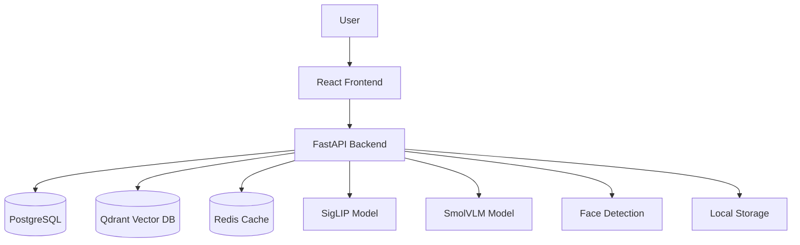

# Media Search System

An AI-powered image search system using **SigLIP embeddings** (global + local), **VLM (Vision-Language Model)** for deep search, **face detection**, **Qdrant** vector database, **PostgreSQL** metadata storage, and a modern **React** frontend with a premium pixel art aesthetic.

## 🎯 Features

- **Two-Stage Search**: Global recall + local crop re-ranking for superior accuracy
- **Deep Search with VLM**: Generate detailed AI descriptions for advanced semantic search
- **Face Detection**: Detect and search for people in images
- **SigLIP Embeddings**: State-of-the-art vision-language model with semantic query expansion
- **Query Expansion**: Automatic semantic understanding (e.g., "dog" → "puppy", "canine", "pet")
- **Score Calibration**: Temperature-based scoring for tunable precision/recall
- **Local Storage**: Images stored on disk (easily migrated to cloud)
- **Modern UI**: Premium pixel art design with glassmorphism and smooth animations
- **Drag & Drop**: Easy image upload interface
- **Redis Caching**: Fast embedding retrieval
- **Spell Checking**: Automatic query correction and suggestions

## 🏗️ Architecture

### System Overview



### Search Algorithm

#### Normal Search (Fast)

1. **Global Recall**
   - Query → SigLIP text encoder
   - Query expansion (semantic terms)
   - Search Qdrant for Top-50 candidates using global embeddings
   
2. **Local Re-ranking** (Accurate)
   - For each candidate, generate 5 crops (1 center + 4 grid)
   - Compute SigLIP embeddings for each crop
   - Find max similarity across crops
   
3. **Final Score**
   ```
   final_score = 0.7 × global_similarity + 0.3 × local_max_similarity
   calibrated_score = sigmoid(final_score × temperature)
   ```

#### Deep Search (Most Accurate)

1. **VLM Description Generation**
   - Upload images → SmolVLM generates detailed descriptions
   - Descriptions stored in PostgreSQL
   
2. **Hybrid Search**
   - Text search on VLM descriptions
   - Vector search on SigLIP embeddings
   - Combined ranking for best results

### Data Flow

```
Upload: Image → SigLIP Embedding → Face Detection → PostgreSQL + Qdrant + Storage
Search: Query → Expansion → Text Embedding → Qdrant Search → Local Re-rank → Results
Deep Search: Query → VLM Descriptions + Vector Search → Hybrid Ranking → Results
```

## 🚀 Setup

### Prerequisites

- **Python 3.10+**
- **Node.js 18+**
- **PostgreSQL 14+**
- **Qdrant** (Docker recommended)
- **Redis** (Optional, for caching)
- **CUDA-capable GPU** (RTX 3050 4GB or better recommended for VLM)

### 1. Start Services

#### Qdrant (Vector Database)
```bash
docker run -p 6333:6333 qdrant/qdrant
```

#### PostgreSQL
```bash
# Create database
createdb media_search

# Or use existing PostgreSQL instance
# Update credentials in backend/.env
```

#### Redis (Optional)
```bash
docker run -p 6379:6379 redis
```

### 2. Backend Setup

```bash
cd backend

# Windows: Use setup script
setup_venv.bat

# Or manually:
python -m venv venv
venv\Scripts\activate  # Windows
# source venv/bin/activate  # Linux/Mac

# Install dependencies
pip install -r requirements.txt

# Configure environment (optional)
copy .env.example .env
# Edit .env with your settings

# Start server
python main.py
# Or use: run_backend.bat
```

The backend will:
- Initialize PostgreSQL schema
- Create Qdrant collection
- Download SigLIP model (~1GB)
- Download SmolVLM model if using deep search (~2GB)
- Start API on http://localhost:8000

### 3. Frontend Setup

```bash
cd frontend

# Install dependencies
npm install

# Start dev server
npm run dev
```

Frontend will be available at **http://localhost:5173**

## 📖 API Documentation

### Health Check
```http
GET /
```

### Upload Image
```http
POST /upload
Content-Type: multipart/form-data

Body: file (image file)

Response:
{
  "image_id": "uuid",
  "file_path": "storage/images/uuid.jpg",
  "message": "Image uploaded and indexed successfully"
}
```

### Normal Search
```http
POST /search
Content-Type: application/json

{
  "query": "man walking at night",
  "top_k": 10
}

Response:
{
  "query": "man walking at night",
  "results": [
    {
      "image_id": "uuid",
      "image_url": "/images/uuid.jpg",
      "score": 0.85,
      "global_score": 0.82,
      "local_score": 0.91
    }
  ],
  "total": 10
}
```

### Deep Search (VLM-based)
```http
POST /deep-search
Content-Type: application/json

{
  "query": "person wearing red jacket",
  "top_k": 10
}
```

### Generate VLM Descriptions
```http
POST /batch-describe
Content-Type: application/json

{
  "image_ids": ["uuid1", "uuid2"]
}
```

### Face Detection
```http
POST /detect-faces
Content-Type: multipart/form-data

Body: file (image file)

Response:
{
  "faces": [
    {
      "bbox": [x, y, width, height],
      "confidence": 0.99
    }
  ]
}
```

### Gallery
```http
GET /gallery?page=1&page_size=50
```

### Delete Images
```http
DELETE /images
Content-Type: application/json

Body: ["image-id-1", "image-id-2"]
```

### Spell Check
```http
POST /spell-check
Content-Type: application/json

{
  "query": "sunst"
}

Response:
{
  "corrected": "sunset",
  "suggestions": ["sunset", "sunlit"]
}
```

### Search Suggestions
```http
GET /search-suggestions?query=sun
```

## 🎨 Tech Stack

### Backend
- **FastAPI** - Modern Python web framework
- **SigLIP** - Vision-language embeddings (google/siglip-base-patch16-224)
- **SmolVLM** - Vision-language model for image descriptions (HuggingFaceTB/SmolVLM-500M-Instruct)
- **Qdrant** - Vector similarity search
- **PostgreSQL** - Metadata storage
- **Redis** - Embedding cache
- **PyTorch** - Deep learning framework
- **OpenCV** - Face detection
- **Transformers** - HuggingFace model library

### Frontend
- **React 18** - UI framework
- **Vite** - Build tool
- **Axios** - HTTP client
- **Modern CSS** - Pixel art design with glassmorphism & animations

## 📁 Project Structure

```
Media-Search/
├── backend/
│   ├── main.py                    # FastAPI application
│   ├── config.py                  # Configuration
│   ├── database.py                # PostgreSQL connection
│   ├── models.py                  # Pydantic models
│   ├── embedding_service.py       # SigLIP service
│   ├── vlm_service.py             # SmolVLM service
│   ├── face_service.py            # Face detection
│   ├── clustering_service.py      # Image clustering
│   ├── redis_cache.py             # Redis cache
│   ├── search_helper.py           # Spell checking
│   ├── services/
│   │   ├── embeddings.py          # Embedding generation
│   │   ├── search.py              # Search logic
│   │   └── query_expansion.py     # Semantic query expansion
│   ├── routers/                   # API route handlers
│   ├── workers/                   # Background workers
│   ├── batch_describe_images.py   # Batch VLM processing
│   ├── batch_describe_enhanced.py # Enhanced batch processing
│   ├── reindex.py                 # Reindex utility
│   ├── reprocess_vlm.py           # Reprocess VLM descriptions
│   ├── requirements.txt           # Python dependencies
│   ├── setup_venv.bat             # Setup script (Windows)
│   └── run_backend.bat            # Run script (Windows)
├── frontend/
│   ├── src/
│   │   ├── App.jsx                # Main component
│   │   ├── components/            # React components
│   │   ├── App.css                # Styles
│   │   └── main.jsx               # Entry point
│   ├── index.html
│   ├── package.json
│   └── vite.config.js
├── storage/
│   └── images/                    # Local image storage
├── data/
│   └── images/                    # Image data directory
├── docker-compose.yml             # Docker services
└── README.md                      # This file
```

## 🔧 Configuration

### Environment Variables

Create `backend/.env` from `backend/.env.example`:

```bash
# Database
POSTGRES_HOST=localhost
POSTGRES_PORT=5432
POSTGRES_DB=media_search
POSTGRES_USER=postgres
POSTGRES_PASSWORD=your_password

# Qdrant
QDRANT_HOST=localhost
QDRANT_PORT=6333

# Redis (optional)
REDIS_HOST=localhost
REDIS_PORT=6379

# Models
SIGLIP_MODEL=google/siglip-base-patch16-224
VLM_MODEL=HuggingFaceTB/SmolVLM-500M-Instruct
DEVICE=cuda  # or cpu

# Search Parameters
TEMPERATURE=25.0  # Score calibration (15-35, lower = more lenient)
```

### Configuration Options

Edit `backend/config.py` to customize:

| Parameter | Default | Description |
|-----------|---------|-------------|
| `SIGLIP_MODEL` | siglip-base-patch16-224 | SigLIP model variant |
| `VLM_MODEL` | SmolVLM-500M-Instruct | VLM model for descriptions |
| `DEVICE` | cuda | Device for inference (cpu/cuda) |
| `TEMPERATURE` | 25.0 | Score calibration temperature |
| `NUM_CROPS` | 5 | Number of crops for local re-ranking |
| `GLOBAL_WEIGHT` | 0.7 | Weight for global score |
| `LOCAL_WEIGHT` | 0.3 | Weight for local score |

## 🎯 Performance & Optimization

### GPU Optimization (RTX 3050 4GB)

- **SigLIP**: Uses ~1-1.5GB VRAM
- **SmolVLM-500M**: Uses ~2-3GB VRAM with 4-bit quantization
- **Face Detection**: CPU-based, minimal impact
- Global embeddings computed once at upload
- Local embeddings only for Top-50 candidates
- 5 crops per image (manageable GPU load)

### Search Performance

- **Normal Search**: 2-5 seconds
- **Deep Search**: 1-3 seconds (if descriptions pre-generated)
- **VLM Description Generation**: ~3-5 seconds per image

### Tips for Better Performance

1. **Enable Redis caching** for faster embedding retrieval
2. **Pre-generate VLM descriptions** using `batch_describe_images.py`
3. **Adjust temperature** for precision/recall tradeoff
4. **Use GPU** for significantly faster inference
5. **Reduce NUM_CROPS** if search is too slow

## 🔍 Advanced Features

### Query Expansion

The system automatically expands queries with semantic terms:

```python
"dog" → ["dog", "puppy", "canine", "pet", "animal", "pup"]
"car" → ["car", "vehicle", "automobile", "auto"]
"sunset" → ["sunset", "dusk", "twilight", "evening"]
```

100+ semantic mappings included in `backend/services/query_expansion.py`

### Score Calibration

Scores are calibrated using temperature-based sigmoid:

```python
calibrated_score = sigmoid(raw_similarity × temperature)
```

- **Lower temperature (15-18)**: More lenient, more results
- **Higher temperature (25-35)**: Stricter, better quality
- **Default (25)**: Balanced

### Tuning Tools

#### Debug Tool - Analyze Image Scores
```bash
cd backend
python debug_siglip_scores.py
```
Shows semantic profile and temperature recommendations.

#### Interactive Tuning
```bash
cd backend
python tune_siglip_interactive.py
```
Commands: `recommend`, `test <query>`, `compare <query>`, `all <temp>`, `quit`

### Batch Processing

Generate VLM descriptions for all images:
```bash
cd backend
python batch_describe_images.py
```

Enhanced batch processing with better prompts:
```bash
python batch_describe_enhanced.py
```

Reprocess existing images:
```bash
python reprocess_vlm.py
```

### Reindexing

Reindex all images (useful after model changes):
```bash
cd backend
python reindex.py
```

## 🐛 Troubleshooting

### Model Loading Issues

**Problem**: SigLIP/VLM model not loading
- Ensure sufficient RAM/VRAM (SigLIP: ~2GB, VLM: ~3GB)
- Check internet connection for first-time download
- Models cached in `~/.cache/huggingface/`

**Problem**: CUDA out of memory
- Reduce batch size in VLM processing
- Use 4-bit quantization for VLM
- Close other GPU applications
- Use CPU mode: `DEVICE=cpu`

### Database Connection Errors

**Problem**: Cannot connect to PostgreSQL/Qdrant/Redis
- Verify services are running: `docker ps`
- Check connection settings in `.env`
- Ensure ports are not blocked by firewall
- Test connections manually

### Search Quality Issues

**Problem**: Low search scores
1. Run `python debug_siglip_scores.py` to analyze
2. Lower temperature (15-18) in `config.py`
3. Add metadata/tags to images
4. Use Deep Search with VLM descriptions

**Problem**: Not enough results
- Lower temperature setting
- Check query expansion is working
- Verify images are properly indexed
- Run reindex if needed

**Problem**: Too many irrelevant results
- Increase temperature (28-35)
- Use Deep Search for better precision
- Add more specific query terms

### Performance Issues

**Problem**: Slow search
- Enable Redis caching
- Use GPU instead of CPU
- Reduce NUM_CROPS (default: 5)
- Pre-generate VLM descriptions

**Problem**: Slow upload
- Batch upload multiple images
- Use background workers
- Optimize image sizes before upload

### Frontend Issues

**Problem**: Cannot connect to backend
- Verify backend is running on port 8000
- Check CORS settings in `main.py`
- Ensure frontend proxy is configured

**Problem**: Images not displaying
- Check storage path configuration
- Verify static file serving in FastAPI
- Check browser console for errors

## 🚀 Future Enhancements

- [ ] Cloud storage integration (S3, GCS)
- [ ] Advanced metadata extraction and filtering
- [ ] Batch upload processing with progress tracking
- [ ] Search history and favorites
- [ ] Multi-modal search (image + text)
- [ ] Video frame search
- [ ] Duplicate image detection
- [ ] Image clustering and organization
- [ ] User authentication and multi-user support
- [ ] Mobile app

## 📝 License

MIT

## 🙏 Acknowledgments

- **SigLIP** by Google Research
- **SmolVLM** by HuggingFace
- **Qdrant** for vector search
- **FastAPI** for the excellent web framework
- **React** and **Vite** for frontend tooling
