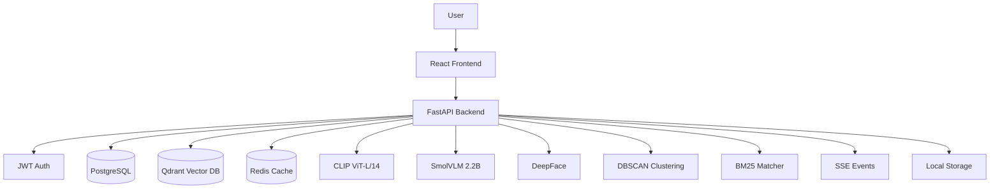

# Media Search System

An AI-powered personal image retrieval system using a **two-stage CLIP pipeline** (global recall + local crop re-ranking), **VLM-augmented hybrid search** (BM25 + CLIP over SmolVLM descriptions), **face detection & clustering** (DeepFace + DBSCAN), **Qdrant** vector database, **PostgreSQL** metadata storage, **JWT authentication**, and a modern **React** frontend.

> 📄 **Research Paper**: [Two-Stage CLIP Re-Ranking with VLM-Augmented Hybrid Search for Scalable Personal Image Retrieval](Paper/paper.tex)

## 🎯 Features

- **Two-Stage CLIP Search**: Global ViT-L/14 recall + 5-crop local re-ranking for spatial precision
- **Deep Hybrid Search**: BM25 keyword matching on VLM descriptions + CLIP semantic embeddings (70/30 fusion)
- **Face Detection & Clustering**: DeepFace (RetinaFace + ArcFace) with DBSCAN, label people, search by name
- **CLIP Embeddings**: ViT-L/14 via OpenCLIP producing 768-dimensional embeddings
- **User Authentication**: JWT-based auth with registration, login, and token refresh
- **Real-Time Updates**: Server-Sent Events (SSE) for live image processing status
- **Background Processing**: Async pipeline (CLIP embedding → face detection → VLM description)
- **Spell Checking**: Automatic query correction and "did you mean" suggestions
- **Query Expansion**: Automatic semantic expansion (e.g., "dog" → "puppy", "canine", "pet")
- **Score Calibration**: Temperature-based sigmoid scoring for tunable precision/recall
- **Two-Tier Redis Caching**: Query result cache (1hr TTL, auto-invalidated on upload/delete) + image embedding cache for diversity filtering
- **Docker Compose**: One-command setup for PostgreSQL, Qdrant, and Redis

## 🏗️ Architecture

### System Overview


```mermaid
graph TB
    User[User] --> Frontend[React Frontend]
    Frontend --> API[FastAPI Backend]
    API --> AuthService[JWT Auth]
    API --> PG[(PostgreSQL)]
    API --> Qdrant[(Qdrant Vector DB)]
    API --> Redis[(Redis Cache)]
    API --> CLIP[CLIP ViT-L/14]
    API --> VLM[SmolVLM 2.2B]
    API --> Face[DeepFace]
    API --> Clustering[DBSCAN Clustering]
    API --> BM25[BM25 Matcher]
    API --> SSE[SSE Events]
    API --> Storage[Local Storage]
```

### Search Pipeline

#### Mode 1 — CLIP Search with Local Re-Ranking (Fast)

1. **Global Recall**: Query → CLIP text encoder → Qdrant ANN top-K (cosine similarity)
2. **Local Re-Ranking**: For each candidate, generate 5 crops (1 centre + 4 quadrants) → CLIP image encoder → max crop similarity
3. **Final Score**:
   ```
   final_score = 0.6 × global_similarity + 0.4 × max_local_similarity
   ```

#### Mode 2 — Deep Hybrid Search (Most Accurate)

1. **BM25 keyword matching** on SmolVLM-generated image descriptions (70% weight)
2. **CLIP semantic embedding** matching (30% weight)
3. **Combined ranking** for best results on attribute-specific queries

### Data Flow

```
Upload:  Image → Save → S3/Disk → Background Task → CLIP Embed + Face Detect + VLM Describe → PostgreSQL + Qdrant + Redis (embed cache) → Invalidate Redis query cache
Search:  Query → Redis cache check (hit: return instantly) → Spell Check → Expansion → CLIP Text Embed → Qdrant ANN → Local Re-rank → Diversity Filter (Redis embed cache) → Store in Redis → Results
Deep:    Query → Redis cache check (hit: return instantly) → BM25 on VLM Descriptions + CLIP Embeddings → Hybrid Score → Store in Redis → Results
Faces:   Upload → RetinaFace Detection → ArcFace Embedding → DBSCAN Clustering → Named People
```

## 📊 Performance

Evaluated on the Flickr8k dataset:

| Metric | M0: Global CLIP | M1: + Re-Ranking | M2: Hybrid (100-img subset) |
|--------|----------------|-------------------|------------------------------|
| mAP | 0.4724 | 0.4904 | 0.7169 |
| Recall@20 | 0.7854 | 0.7969 | 0.9289 |
| Precision@5 | 0.1205 | 0.1244 | 0.1719 |
| QSR | 52.8% | 54.8% | 80.8% |

### Latency (NVIDIA RTX 3050)

| Operation | Avg |
|-----------|-----|
| CLIP Search (end-to-end) | 65 ms |
| Re-Rank Search (end-to-end) | 290 ms |
| Hybrid Search (end-to-end) | 240 ms |
| VLM description (per image) | 11.4 s |

## 🚀 Setup

### Prerequisites

- **Python 3.10+**
- **Node.js 18+**
- **Docker & Docker Compose** (for PostgreSQL, Qdrant, Redis)
- **CUDA-capable GPU** (recommended, ~1.5 GB VRAM for CLIP)

### 1. Start Infrastructure Services

```bash
docker compose up -d
```

This starts PostgreSQL 16, Qdrant, and Redis via `docker-compose.yml`.

### 2. Backend Setup

```bash
cd backend

# Create and activate virtual environment
python -m venv venv
venv\Scripts\activate        # Windows
# source venv/bin/activate   # Linux/Mac

# Install dependencies
pip install -r requirements.txt

# Configure environment
copy .env.example .env       # Windows
# cp .env.example .env       # Linux/Mac
# Edit .env with your settings

# Start server
python main.py
```

The backend will:
- Initialize PostgreSQL schema (async SQLAlchemy)
- Create Qdrant collections (images + faces)
- Load CLIP ViT-L/14 (~1 GB download on first run)
- Start API on http://localhost:8000

### 3. Frontend Setup

```bash
cd frontend
npm install
npm run dev
```

Frontend available at **http://localhost:5173**

## 📖 API Documentation

### Auth Endpoints (`/api/auth`)
```http
POST /api/auth/register     Register a new user
POST /api/auth/login        Login and get JWT tokens
POST /api/auth/refresh      Refresh access token
GET  /api/auth/me           Get current user info
```

### Image Endpoints (`/api/images`)
```http
POST   /api/images/upload             Upload one or more images (background processing)
GET    /api/images/?skip=0&limit=50   List user's images
GET    /api/images/{image_id}         Get image details
DELETE /api/images/{image_id}         Delete image and all related data
GET    /api/images/{image_id}/status  Get processing status
```

### Search Endpoints (`/api/search`)
```http
GET /api/search/normal?q=sunset&top_k=20&auto_correct=true
GET /api/search/deep?q=sunset&top_k=20&auto_correct=true
```

### Face Endpoints (`/api/faces`)
```http
GET  /api/faces/clusters                      List all face clusters
GET  /api/faces/clusters/{cluster_id}/images  Get images in a cluster
PUT  /api/faces/clusters/{cluster_id}/name    Name a face cluster
GET  /api/faces/search?name=John              Search images by person name
```

### SSE Endpoint
```http
GET /api/events/stream?token=<jwt_token>    Real-time processing status updates
```

All authenticated endpoints require `Authorization: Bearer <token>` header.

## 🎨 Tech Stack

### Backend
- **FastAPI** — Async Python web framework
- **CLIP** (ViT-L/14) — Vision-language embeddings via `open-clip-torch`
- **SmolVLM** (2.2B) — Image description generation via HuggingFace Transformers
- **Qdrant** — Vector similarity search (ANN)
- **PostgreSQL** + **SQLAlchemy** (async) — Metadata and user storage
- **Redis** — Two-tier cache: query result cache (keyed by `user_id + query`, 1hr TTL, invalidated on upload/delete) + image embedding cache (permanent, keyed by `image_id`) for diversity filtering
- **PyTorch** — Deep learning runtime (CUDA accelerated)
- **DeepFace** — Face detection (RetinaFace) + face embeddings (ArcFace)
- **scikit-learn** — DBSCAN face clustering
- **rank-bm25** — BM25 keyword matching for hybrid search
- **PyJWT** + **bcrypt** — JWT authentication
- **SSE-Starlette** — Server-Sent Events
- **pyspellchecker** — Query spell correction

### Frontend
- **React 18** — UI framework
- **React Router v7** — Client-side routing
- **Vite** — Build tool and dev server
- **Axios** — HTTP client with JWT interceptors
- **Modern CSS** — Custom design with glassmorphism & animations

## 📁 Project Structure

```
Media-Search/
├── backend/
│   ├── main.py                    # FastAPI app entry point
│   ├── config.py                  # Configuration (env vars + defaults)
│   ├── database.py                # PostgreSQL async connection + schema
│   ├── models.py                  # Pydantic request/response models
│   ├── requirements.txt           # Python dependencies
│   ├── .env.example               # Environment template
│   ├── routers/                   # Authenticated API endpoints
│   │   ├── __init__.py
│   │   ├── auth.py                # Register, login, refresh, me
│   │   ├── images.py              # Upload, list, get, delete, status
│   │   ├── search.py              # Normal + deep search + SSE
│   │   └── faces.py               # Face clusters, labelling, search
│   └── services/                  # Core business logic
│       ├── __init__.py
│       ├── embedding_service.py   # CLIP encoding (image + text + crops)
│       ├── vlm_service.py         # SmolVLM description generation
│       ├── face_service.py        # DeepFace face detection
│       ├── clustering_service.py  # DBSCAN face clustering
│       ├── bm25_matcher.py        # BM25 keyword matching
│       ├── auth_service.py        # JWT + bcrypt auth logic
│       ├── redis_cache.py         # Redis cache: query results (TTL + invalidation) + image embeddings
│       └── search_helper.py       # Spell checking & query suggestions
├── frontend/
│   ├── src/
│   │   ├── App.jsx                # Main app with routing
│   │   ├── main.jsx               # Entry point
│   │   ├── App.css                # Global styles
│   │   ├── index.css              # Base styles
│   │   ├── api/
│   │   │   ├── client.js          # Axios instance with auth interceptors
│   │   │   └── auth.js            # Auth API calls
│   │   ├── context/
│   │   │   └── AuthContext.jsx    # Auth state management
│   │   ├── pages/
│   │   │   ├── Login.jsx          # Login page
│   │   │   ├── Signup.jsx         # Registration page
│   │   │   └── Signup.css
│   │   └── components/
│   │       ├── Gallery.jsx/.css   # Image gallery with upload
│   │       ├── Search.jsx/.css    # Search interface
│   │       ├── ImageCard.jsx/.css # Image card component
│   │       ├── People.jsx/.css    # Face clusters view
│   │       ├── Toast.jsx/.css     # Toast notifications
│   │       ├── ProtectedRoute.jsx # Auth route guard
│   │       └── SearchModal.css    # Search modal styles
│   ├── index.html
│   ├── package.json
│   └── vite.config.js
├── images/                        # Architecture diagrams (SVG)
│   └── diagrams/                  # System flow diagrams
├── Paper/                         # Research paper (IEEE format)
│   └── paper.tex
├── Report/                        # University project report
│   └── report.tex
├── Metrics/                       # Evaluation scripts & results
├── docker-compose.yml             # PostgreSQL + Qdrant + Redis
├── colab_flickr8k_eval.py         # Flickr8k evaluation script (Colab)
├── .env.example                   # Root environment template
└── README.md
```

## 🔧 Configuration

### Environment Variables

Create `backend/.env` from `backend/.env.example`:

```bash
# Database
POSTGRES_HOST=localhost
POSTGRES_PORT=5432
POSTGRES_DB=media_search
POSTGRES_USER=user
POSTGRES_PASSWORD=password

# Qdrant
QDRANT_HOST=localhost
QDRANT_PORT=6333

# Redis (optional)
REDIS_HOST=localhost
REDIS_PORT=6379

# Model Configuration
CLIP_MODEL=ViT-L-14
CLIP_PRETRAINED=openai
DEVICE=cpu  # or cuda

# API
API_HOST=0.0.0.0
API_PORT=8000
```

### Key Parameters

| Parameter | Default | Description |
|-----------|---------|-------------|
| `CLIP_MODEL` | ViT-L-14 | CLIP model variant |
| `DEVICE` | auto-detect | Inference device (cpu/cuda) |
| `SCORE_THRESHOLD` | 0.20 | Min score for normal search |
| `DEEP_SEARCH_THRESHOLD` | 0.35 | Min score for deep search |
| `NUM_CROPS` | 5 | Crops for local re-ranking (1 centre + 4 quadrants) |
| `GLOBAL_WEIGHT` | 0.6 | Weight for global CLIP similarity |
| `LOCAL_WEIGHT` | 0.4 | Weight for local crop similarity |
| `BM25_WEIGHT` | 0.7 | BM25 weight in hybrid deep search |
| `CLIP_WEIGHT` | 0.3 | CLIP weight in hybrid deep search |
| `ENABLE_VLM` | true | Enable SmolVLM descriptions |

## 🔍 Advanced Features

### Query Expansion

Automatic semantic expansion with 100+ mappings:

```python
"dog"    → ["dog", "puppy", "canine", "pet", "animal", "pup"]
"car"    → ["car", "vehicle", "automobile", "auto"]
"sunset" → ["sunset", "dusk", "twilight", "evening"]
```

### Score Calibration

Temperature-based sigmoid scoring:
```python
calibrated_score = sigmoid(raw_similarity × temperature)
```

- **Lower temperature (15–18)**: More lenient, more results
- **Higher temperature (25–35)**: Stricter, higher quality
- **Default (25)**: Balanced

## 🐛 Troubleshooting

### Model Loading
- **CLIP not loading**: Ensure ~2 GB RAM/VRAM; models download to `~/.cache/huggingface/`
- **CUDA OOM**: Set `DEVICE=cpu` in `.env` or close other GPU apps

### Database Connectivity
- Verify services: `docker compose ps`
- Check `.env` credentials match `docker-compose.yml`
- Ensure ports 5432, 6333, 6379 are not blocked

### Search Quality
- **Low scores**: Lower `SCORE_THRESHOLD` in `config.py`
- **Not enough results**: Use Deep Search with VLM descriptions
- **Too many irrelevant results**: Increase thresholds

### Authentication
- **401 Unauthorized**: Check JWT token in `Authorization: Bearer <token>` header
- **Token expired**: Refresh via `POST /api/auth/refresh`

## 🚀 Future Enhancements

- [ ] Multi-GPU scaling for large upload streams
- [ ] Video frame search (keyframe extraction)
- [ ] Domain-specific CLIP fine-tuning
- [ ] Active learning for face clustering (user feedback)
- [ ] Systematic fusion weight optimisation
- [ ] VLM hallucination filtering (confidence-based)
- [ ] Mobile client (React Native)
- [ ] Cloud storage integration (S3, GCS)


## Acknowledgements

- **SmolVLM** by HuggingFace — Image descriptions
- **Qdrant** — Vector search engine
- **FastAPI** — Python web framework
- **DeepFace** — Face detection & recognition
- **React** & **Vite** — Frontend tooling
- **PyTorch** — Deep learning framework
