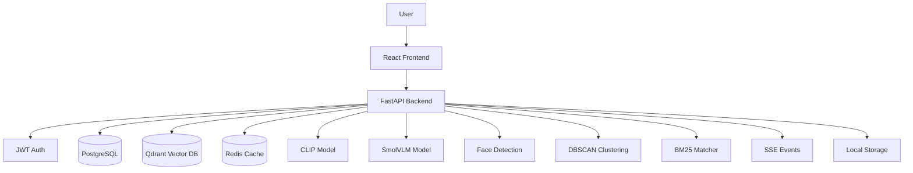

# Media Search System

An AI-powered image search system using **CLIP embeddings** (global + local), **VLM (Vision-Language Model)** for deep search, **face detection & clustering**, **Qdrant** vector database, **PostgreSQL** metadata storage, **JWT authentication**, **image sharing**, **real-time SSE updates**, and a modern **React** frontend with a premium pixel art aesthetic.

## 🎯 Features

- **Two-Stage Search**: Global recall + local crop re-ranking for superior accuracy
- **Deep Search with VLM**: BM25 keyword matching + CLIP semantic matching for hybrid search
- **Face Detection & Clustering**: Detect faces, auto-cluster with DBSCAN, label people, and search by person
- **CLIP Embeddings**: State-of-the-art vision-language model (ViT-L-14) with semantic query expansion
- **Query Expansion**: Automatic semantic understanding (e.g., "dog" → "puppy", "canine", "pet")
- **Score Calibration**: Temperature-based sigmoid scoring for tunable precision/recall
- **User Authentication**: JWT-based auth with registration, login, and token refresh
- **Image Sharing**: Share images with other users with view/download permissions
- **Real-Time Updates**: Server-Sent Events (SSE) for live image processing status
- **Background Processing**: Async image pipeline (embedding, face detection, VLM descriptions)
- **Spell Checking**: Automatic query correction and "did you mean" suggestions
- **Local Storage**: Images stored on disk (easily migrated to cloud)
- **Modern UI**: Premium pixel art design with glassmorphism and smooth animations
- **Drag & Drop**: Easy image upload interface
- **Redis Caching**: Fast embedding retrieval

## 🏗️ Architecture

### System Overview


```mermaid
graph TB
    User[User] --> Frontend[React Frontend]
    Frontend --> API[FastAPI Backend]
    API --> AuthModule[JWT Auth]
    API --> PG[(PostgreSQL)]
    API --> Qdrant[(Qdrant Vector DB)]
    API --> Redis[(Redis Cache)]
    API --> CLIP[CLIP Model]
    API --> VLM[SmolVLM Model]
    API --> Face[Face Detection]
    API --> Clustering[DBSCAN Clustering]
    API --> BM25[BM25 Matcher]
    API --> SSE[SSE Events]
    API --> Storage[Local Storage]
```

### Search Algorithm

#### Normal Search (Fast)

1. **Global Recall**
   - Query → CLIP text encoder
   - Query expansion (semantic terms)
   - Search Qdrant for Top-K candidates using global embeddings
   
2. **Local Re-ranking** (Accurate)
   - For each candidate, generate 5 crops (1 center + 4 grid)
   - Compute CLIP embeddings for each crop
   - Find max similarity across crops
   
3. **Final Score**
   ```
   final_score = 0.6 × global_similarity + 0.4 × local_max_similarity
   calibrated_score = sigmoid(final_score × temperature)
   ```

#### Deep Search (Most Accurate)

1. **Hybrid Matching**
   - BM25 keyword matching on VLM descriptions (70% weight)
   - CLIP semantic embedding matching (30% weight)
   - Combined ranking for best results

2. **Metadata Matching**
   - Soft metadata filters enhance ranking
   - VLM validation of top candidates

### Data Flow

```
Upload:    Image → Save → Background Task → CLIP Embedding + Face Detection → PostgreSQL + Qdrant + Storage
Search:    Query → Spell Check → Expansion → Text Embedding → Qdrant Search → Local Re-rank → Results
Deep:      Query → BM25 on VLM Descriptions + CLIP Embeddings → Hybrid Score → Results
Faces:     Upload → Face Detection → Embedding → DBSCAN Clustering → Named People
```

## 🚀 Setup

### Prerequisites

- **Python 3.10+**
- **Node.js 18+**
- **PostgreSQL 14+**
- **Qdrant** (Docker recommended)
- **Redis** (Optional, for caching)
- **CUDA-capable GPU** (recommended for faster inference)

### 1. Start Services

#### Qdrant (Vector Database)
```bash
docker run -p 6333:6333 qdrant/qdrant
```

#### PostgreSQL
```bash
# Create database
createdb media_search

# Or use existing PostgreSQL instance
# Update credentials in backend/.env
```

#### Redis (Optional)
```bash
docker run -p 6379:6379 redis
```

### 2. Backend Setup

```bash
cd backend

# Windows: Use setup script
setup_venv.bat

# Or manually:
python -m venv venv
venv\Scripts\activate  # Windows
# source venv/bin/activate  # Linux/Mac

# Install dependencies
pip install -r requirements.txt

# Configure environment
copy .env.example .env
# Edit .env with your settings

# Start server
python main.py
# Or use: run_backend.bat
```

The backend will:
- Initialize PostgreSQL schema
- Create Qdrant collections (images + faces)
- Download CLIP model (ViT-L-14, ~1GB)
- Start API on http://localhost:8000

### 3. Frontend Setup

```bash
cd frontend

# Install dependencies
npm install

# Start dev server
npm run dev
```

Frontend will be available at **http://localhost:5173**

## 📖 API Documentation

### Legacy Endpoints (main.py)

These endpoints exist in `main.py` and do not require authentication:

#### Health Check
```http
GET /
```

#### Upload Image
```http
POST /upload
Content-Type: multipart/form-data

Body: file (image file)

Response:
{
  "image_id": "uuid",
  "file_path": "storage/images/uuid.jpg",
  "message": "Image uploaded and indexed successfully"
}
```

#### Search
```http
POST /search
Content-Type: application/json

{
  "query": "man walking at night",
  "top_k": 10
}
```

#### Deep Search (BM25 + CLIP Hybrid)
```http
POST /deep-search
Content-Type: application/json

{
  "query": "person wearing red jacket",
  "top_k": 10
}
```

#### Gallery
```http
GET /gallery?page=1&page_size=50
```

#### Delete Images
```http
DELETE /images
Content-Type: application/json

Body: ["image-id-1", "image-id-2"]
```

#### People / Face Clusters
```http
GET /people
POST /people/{cluster_id}/label    Body: {"name": "John"}
GET /people/{cluster_id}/images
DELETE /people/{cluster_id}
POST /cluster-faces
```

#### VLM Reprocessing
```http
POST /reprocess-vlm
```

#### Image Details
```http
GET /image/{image_id}
```

#### Spell Check
```http
POST /spell-check
Body: {"query": "sunst"}

Response:
{
  "corrected": "sunset",
  "suggestions": ["sunset", "sunlit"]
}
```

#### Search Suggestions
```http
GET /search-suggestions?query=sun
```

---

### Router-Based Endpoints (Authenticated)

These endpoints require a JWT `Authorization: Bearer <token>` header.

#### Auth (`/api/auth`)
```http
POST /api/auth/register     Register a new user
POST /api/auth/login         Login and get JWT tokens
POST /api/auth/refresh       Refresh access token
GET  /api/auth/me            Get current user info
```

#### Images (`/api/images`)
```http
POST /api/images/upload              Upload one or more images (background processing)
GET  /api/images/?skip=0&limit=50    List user's images
GET  /api/images/{image_id}          Get image details
DELETE /api/images/{image_id}        Delete image and all related data
GET  /api/images/{image_id}/status   Get processing status
```

#### Search (`/api/search`)
```http
GET /api/search/normal?q=sunset&top_k=20&auto_correct=true
GET /api/search/deep?q=sunset&top_k=20&auto_correct=true
```

#### Shares (`/api/shares`)
```http
POST   /api/shares/           Share an image with another user
DELETE /api/shares/{share_id}  Revoke a share
GET    /api/shares/by-me       Get all shares I've created
GET    /api/shares/with-me     Get all images shared with me
```

#### Faces (`/api/faces`)
```http
GET  /api/faces/clusters                       List all face clusters
GET  /api/faces/clusters/{cluster_id}/images   Get images in a cluster
PUT  /api/faces/clusters/{cluster_id}/name     Name a face cluster
GET  /api/faces/search?name=John               Search images by person name
```

#### SSE (`/api/events`)
```http
GET /api/events/stream?token=<jwt_token>    Real-time processing status updates
```

## 🎨 Tech Stack

### Backend
- **FastAPI** - Modern Python web framework
- **CLIP** (ViT-L-14) - Vision-language embeddings via open-clip-torch
- **SmolVLM** - Vision-language model for image descriptions
- **Qdrant** - Vector similarity search
- **PostgreSQL** + **SQLAlchemy** - Metadata storage (async)
- **Redis** - Embedding cache
- **PyTorch** - Deep learning framework
- **DeepFace** - Face detection
- **scikit-learn** - DBSCAN face clustering
- **BM25** - Keyword matching for deep search
- **JWT** (PyJWT + bcrypt) - Authentication
- **SSE-Starlette** - Server-Sent Events
- **Transformers** - HuggingFace model library
- **pyspellchecker** - Query spell checking

### Frontend
- **React 18** - UI framework
- **React Router v7** - Client-side routing
- **Vite** - Build tool
- **Axios** - HTTP client with auth interceptors
- **Modern CSS** - Pixel art design with glassmorphism & animations

## 📁 Project Structure

```
Media-Search/
├── backend/
│   ├── main.py                    # FastAPI application (legacy endpoints)
│   ├── config.py                  # Configuration (env vars + defaults)
│   ├── database.py                # PostgreSQL/SQLAlchemy async connection
│   ├── models.py                  # Pydantic request/response models
│   ├── embedding_service.py       # Legacy CLIP embedding service
│   ├── vlm_service.py             # SmolVLM description generation
│   ├── face_service.py            # Face detection (DeepFace)
│   ├── clustering_service.py      # DBSCAN face clustering
│   ├── bm25_matcher.py            # BM25 keyword matching
│   ├── redis_cache.py             # Redis cache layer
│   ├── search_helper.py           # Spell checking & suggestions
│   ├── auth/                      # Authentication module
│   │   ├── __init__.py            # Auth exports
│   │   ├── jwt.py                 # JWT token creation/validation
│   │   └── dependencies.py        # Auth dependency injection
│   ├── services/                  # Core business logic
│   │   ├── __init__.py            # Service exports
│   │   ├── embeddings.py          # CLIP encoding (image + text)
│   │   ├── search.py              # Normal + deep search logic
│   │   ├── query_expansion.py     # Semantic query expansion (100+ mappings)
│   │   ├── query_parser.py        # Query parsing utilities
│   │   ├── qdrant.py              # Qdrant vector DB operations
│   │   ├── storage.py             # File storage operations
│   │   ├── events.py              # SSE event bus
│   │   ├── metadata_matcher.py    # Metadata-based matching
│   │   └── vocabulary.py          # Vocabulary utilities
│   ├── routers/                   # Authenticated API routes
│   │   ├── __init__.py            # Router exports
│   │   ├── auth.py                # Register, login, refresh, me
│   │   ├── images.py              # Upload, list, get, delete, status
│   │   ├── search.py              # Normal + deep search
│   │   ├── shares.py              # Image sharing
│   │   ├── faces.py               # Face clusters management
│   │   └── sse.py                 # SSE streaming endpoint
│   ├── workers/                   # Background processing
│   │   ├── __init__.py
│   │   └── processor.py           # Image processing pipeline
│   ├── tune_siglip_interactive.py # Interactive temperature tuning
│   ├── reindex.py                 # Reindex utility
│   ├── requirements.txt           # Python dependencies
│   ├── setup_venv.bat             # Setup script (Windows)
│   └── run_backend.bat            # Run script (Windows)
├── frontend/
│   ├── src/
│   │   ├── App.jsx                # Main app with routing
│   │   ├── main.jsx               # Entry point
│   │   ├── App.css                # Global styles
│   │   ├── index.css              # Base styles
│   │   ├── api/                   # API client layer
│   │   │   ├── client.js          # Axios instance with auth interceptors
│   │   │   ├── auth.js            # Auth API calls
│   │   │   ├── images.js          # Image API calls
│   │   │   ├── search.js          # Search API calls
│   │   │   ├── faces.js           # Faces API calls
│   │   │   └── shares.js          # Sharing API calls
│   │   ├── context/
│   │   │   └── AuthContext.jsx    # Auth state management
│   │   ├── pages/
│   │   │   ├── Login.jsx          # Login page
│   │   │   ├── Signup.jsx         # Registration page
│   │   │   ├── Gallery.jsx        # Image gallery
│   │   │   ├── Search.jsx         # Search page
│   │   │   ├── Faces.jsx          # Face clusters view
│   │   │   └── SharedWithMe.jsx   # Shared images view
│   │   └── components/
│   │       ├── Layout.jsx         # App layout shell
│   │       ├── ProtectedRoute.jsx # Auth route guard
│   │       ├── Gallery.jsx/.css   # Gallery component
│   │       ├── Search.jsx/.css    # Search component
│   │       ├── ImageCard.jsx/.css # Image card component
│   │       ├── People.jsx/.css    # People/faces component
│   │       ├── Toast.jsx/.css     # Toast notifications
│   │       └── SearchModal.css    # Search modal styles
│   ├── public/                    # Static assets
│   ├── index.html
│   ├── package.json
│   └── vite.config.js
├── storage/
│   └── images/                    # Local image storage
├── data/
│   └── images/                    # Image data directory
├── docker-compose.yml             # Docker services
├── .env.example                   # Environment template
└── README.md                      # This file
```

## 🔧 Configuration

### Environment Variables

Create `backend/.env` from `backend/.env.example`:

```bash
# Database
POSTGRES_HOST=localhost
POSTGRES_PORT=5432
POSTGRES_DB=media_search
POSTGRES_USER=user
POSTGRES_PASSWORD=password

# Qdrant
QDRANT_HOST=localhost
QDRANT_PORT=6333

# Redis (optional)
REDIS_HOST=localhost
REDIS_PORT=6379

# Model Configuration
CLIP_MODEL=ViT-L-14
CLIP_PRETRAINED=openai
DEVICE=cpu  # or cuda

# API
API_HOST=0.0.0.0
API_PORT=8000
```

### Configuration Options

Edit `backend/config.py` to customize:

| Parameter | Default | Description |
|-----------|---------|-------------|
| `CLIP_MODEL` | ViT-L-14 | CLIP model variant |
| `DEVICE` | auto-detect | Device for inference (cpu/cuda) |
| `SCORE_THRESHOLD` | 0.20 | Minimum score for normal search |
| `DEEP_SEARCH_THRESHOLD` | 0.35 | Minimum score for deep search |
| `NUM_CROPS` | 5 | Number of crops for local re-ranking |
| `GLOBAL_WEIGHT` | 0.6 | Weight for global similarity |
| `LOCAL_WEIGHT` | 0.4 | Weight for local similarity |
| `BM25_WEIGHT` | 0.7 | BM25 weight in deep search |
| `CLIP_WEIGHT` | 0.3 | CLIP weight in deep search |
| `ENABLE_VLM` | true | Enable VLM for descriptions |

## 🎯 Performance & Optimization

### GPU Optimization

- **CLIP (ViT-L-14)**: Uses ~1-1.5GB VRAM
- **Face Detection**: CPU-based via DeepFace
- Global embeddings computed once at upload
- Local embeddings only for Top-K candidates
- 5 crops per image (manageable GPU load)

### Search Performance

- **Normal Search**: 2-5 seconds
- **Deep Search**: 1-3 seconds (if descriptions pre-generated)

### Tips for Better Performance

1. **Enable Redis caching** for faster embedding retrieval
2. **Pre-generate VLM descriptions** via `POST /reprocess-vlm`
3. **Adjust thresholds** for precision/recall tradeoff
4. **Use GPU** for significantly faster inference
5. **Reduce NUM_CROPS** if search is too slow

## 🔍 Advanced Features

### Query Expansion

The system automatically expands queries with semantic terms:

```python
"dog" → ["dog", "puppy", "canine", "pet", "animal", "pup"]
"car" → ["car", "vehicle", "automobile", "auto"]
"sunset" → ["sunset", "dusk", "twilight", "evening"]
```

100+ semantic mappings included in `backend/services/query_expansion.py`

### Score Calibration

Scores are calibrated using temperature-based sigmoid:

```python
calibrated_score = sigmoid(raw_similarity × temperature)
```

- **Lower temperature (15-18)**: More lenient, more results
- **Higher temperature (25-35)**: Stricter, better quality
- **Default (25)**: Balanced

### Interactive Temperature Tuning

```bash
cd backend
python tune_siglip_interactive.py  # Legacy name, works with CLIP
```
Commands: `recommend`, `test <query>`, `compare <query>`, `all <temp>`, `quit`

### Reindexing

Reindex all images (useful after model changes):
```bash
cd backend
python reindex.py
```

## 🐛 Troubleshooting

### Model Loading Issues

**Problem**: CLIP model not loading
- Ensure sufficient RAM/VRAM (~2GB)
- Check internet connection for first-time download
- Models cached in `~/.cache/huggingface/`

**Problem**: CUDA out of memory
- Use CPU mode: `DEVICE=cpu`
- Close other GPU applications

### Database Connection Errors

**Problem**: Cannot connect to PostgreSQL/Qdrant/Redis
- Verify services are running: `docker ps`
- Check connection settings in `.env`
- Ensure ports are not blocked by firewall

### Search Quality Issues

**Problem**: Low search scores
1. Lower `SCORE_THRESHOLD` in `config.py`
2. Check query expansion is working
3. Use Deep Search with VLM descriptions

**Problem**: Not enough results
- Lower threshold settings
- Verify images are properly indexed
- Run reindex if needed

**Problem**: Too many irrelevant results
- Increase thresholds
- Use Deep Search for better precision

### Authentication Issues

**Problem**: 401 Unauthorized
- Verify JWT token is included in `Authorization: Bearer <token>` header
- Check if token has expired (refresh via `POST /api/auth/refresh`)
- Ensure user exists (register via `POST /api/auth/register`)

### Frontend Issues

**Problem**: Cannot connect to backend
- Verify backend is running on port 8000
- Check CORS settings in `main.py`
- Ensure frontend proxy is configured in `vite.config.js`

**Problem**: Images not displaying
- Check storage path configuration
- Verify static file serving in FastAPI
- Check browser console for errors

## 🚀 Future Enhancements

- [ ] Crash recovery for image processing (resume stuck/failed jobs on restart)
- [ ] API rate limiting per user
- [ ] Cloud storage integration (S3, GCS)
- [ ] Advanced metadata extraction and filtering
- [ ] Batch upload processing with progress tracking
- [ ] Search history and favorites
- [ ] Multi-modal search (image + text)
- [ ] Video frame search
- [ ] Duplicate image detection
- [ ] Mobile app

## 📝 License

MIT

## 🙏 Acknowledgments

- **OpenAI CLIP** for vision-language embeddings
- **SmolVLM** by HuggingFace
- **Qdrant** for vector search
- **FastAPI** for the excellent web framework
- **React** and **Vite** for frontend tooling
- **DeepFace** for face detection
